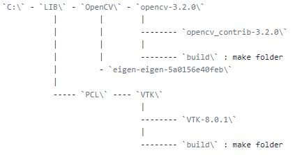

# OpenCV 3.2 Viz Setting

## Env
* OS : windows 10 64 bit
* VS : Visual Studio 2017 
* Cmake : 3.8.2
* VTK : 8.0.1
* Eigen : 3.3.4 (stable version)
* OpenCV : 3.2
* OpenCV_Contrib : 3.2 

## Folder Path Structer

                              
## Build Order
1. cmake build `VTK` library
2. cmake build `OpenCV` library

## Reference Site
* http://blog.livedoor.jp/tmako123-programming/archives/50755640.html
* http://webnautes.tistory.com/1036
* http://kkokkal.tistory.com/1298?category=706441
* http://neodreamer-dev.tistory.com/737
